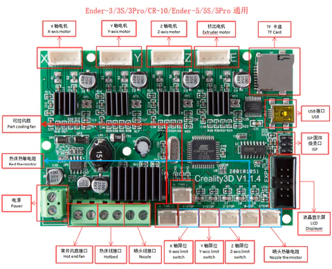

Prelab



bottom of the relay (SONGLE SRS-05VDC-SL) looks like this:
```
+---------+
| *A   B* |
| *V   G* |
|         |
|         |
|         |
| *C1 C2* |
+---------+
```

C1 and C2 are electrically equivalent. By default, they are connected to B. When a voltage is applied they connect to A. The voltage should be between V and G, but in reality the polarity doesn't matter.

3. install cura

4. slice something for creality ender 3

5. disect GCODE

probably, you want something like:

```
M84 E ; Disable the extruder motor (not sure if this helps anything)
G28 ; Home all axes
G90 ; Absolute positioning
G1 F3000 Z2.0 ; Move up a little to prevent scratching the bed
G0 F6000 X50 Y50 Z0.3 ; Move to starting position (G0 is sloppy)
M106 S255 ; Turn on fan at full speed
G1 F1200 X100 Y100 Z0.3 ; Move to end of line (G1 is careful)
M107 ; Turn off fan
G0 F3000 Z2.2 ; Move up to avoid hitting part
G0 F6000 X10 Y10 ; Go back home
M84 X Y ; Disable X & Y motors, not sure why, but cura does it
```

Go to the lab

1. Connect one of the part cooling fan ports to relay.

2. make sure the connectivity works like you think it does

3. try to move the dang thing

4. find the right barrel jack

5. fun times!
